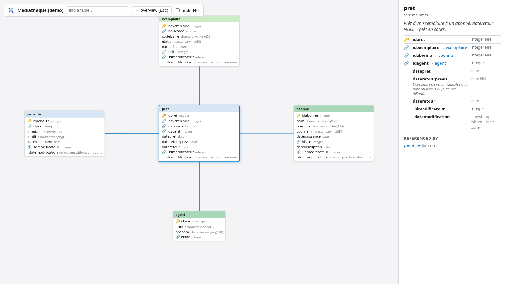

# mcdview


[](https://mcdview.dev/)
[](https://gheop.github.io/mcdview/)
[](https://github.com/Gheop/mcdview/actions/workflows/ci.yml)
[](LICENSE)


Interactive HTML explorer for a SQL data model. From a DDL file
(`CREATE TABLE ...`), mcdview generates a self-contained page — no server,
no dependency — to browse the model: overview of tables grouped by schema,
click a table to isolate it with its related tables, field detail panel,
search box.

PostgreSQL is read out of the box with zero dependencies; MySQL/MariaDB,
SQLite and ~15 other dialects are read when the optional
[sqlglot](https://github.com/tobymao/sqlglot) package is installed.

**Try it without installing anything: [mcdview.dev](https://mcdview.dev/)** —
drop a `.sql` or `.dbm` file and get a shareable link to your model's page.

**[Live demo](https://gheop.github.io/mcdview/exemples/mediatheque.html)** —
a fictional library model (12 tables, 3 schemas).

[](https://gheop.github.io/mcdview/exemples/mediatheque.html)

## Usage

```bash
./mcdview.py model.sql
./mcdview.py model.sql -o explorer.html --titre "My project"
./mcdview.py model.dbm          # pgModeler model (needs pgmodeler-cli)
```

Then open the generated HTML file in a browser.

A `.dbm` input needs `pgmodeler-cli` in the PATH: mcdview delegates the
SQL generation to it (pgModeler resolves its relationships at export time),
and reuses the table positions drawn in the model.

In the page:

- **wheel**: zoom, **drag**: pan;
- **hover a table**: lights up its foreign-key links;
- **click a table**: isolates it with its related tables (the others fade
  out, the view re-frames) and shows its detail on the right — fields,
  types, NOT NULL, DEFAULT, PK 🔑, clickable FK 🔗, table and column
  comments, list of referencing tables; the URL gets a `#schema.table`
  permalink that reopens straight on that table;
- **drag a table** to rearrange the diagram, the links follow live;
- **"rearrange" button**: a force-directed relayout that spreads the tables
  to unclutter the links (disabled above 400 tables, where it would be slow);
- **schema chips** (bottom-left, when there are several schemas): click to
  frame that schema's zone;
- **Escape** or "overview": back to the full, re-framed overview;
- **search** with table name autocompletion.

## Options

| Option | Effect |
|---|---|
| `-o, --sortie FILE` | Output HTML file (default: `<sql>.html`) |
| `--titre TEXT` | Title shown in the page (default: file name) |
| `--dbm FILE` | Reuse table positions from a pgModeler model instead of automatic layout |
| `--fk-audit REGEX` | Tag as "audit" the FKs whose constraint name matches: hidden by default, shown back with a checkbox |
| `--lang {fr,en}` | Language of the page UI (default: `fr`) |
| `--dialect NAME` | Input SQL dialect (default: `auto`); non-PostgreSQL needs `sqlglot` |

Without `--dbm`, mcdview computes an automatic layout: one zone per schema,
tables arranged in balanced columns, related tables pulled together.

## Dialects

PostgreSQL uses the built-in parser (no dependency). For any other dialect,
`pip install sqlglot` and mcdview reads it — MySQL/MariaDB, SQLite, SQL Server
(`tsql`), Oracle, DuckDB, Snowflake, BigQuery, Redshift, ClickHouse, Trino,
Spark, Hive. `--dialect auto` (the default) uses the PostgreSQL parser first
and, when it finds no table, tries several sqlglot dialects and keeps the one
that parses the most tables; pass `--dialect mysql` (etc.) to force one. Proprietary binary model files
(MySQL Workbench `.mwb` and the like) are not read directly — export their
DDL to `.sql` first; only pgModeler `.dbm` is handled natively.

`--fk-audit` is for models where every table carries audit columns
(`created_by`, `modified_by`...) pointing to a users table: those FKs turn
that table into a hub linked to everything and clutter the graph.

## What mcdview reads from the DDL

- `CREATE TABLE [schema.]table (...)`: columns, types, NOT NULL, DEFAULT
  (tables without an explicit schema go to `public`);
- primary keys, inline (`CONSTRAINT ... PRIMARY KEY`) or added afterwards
  (`ALTER TABLE ... ADD CONSTRAINT ... PRIMARY KEY`, `pg_dump -s` style);
- `ALTER TABLE ... ADD CONSTRAINT ... FOREIGN KEY ... REFERENCES ...`,
  including composite keys and targets without an explicit column list
  (resolved against the target's primary key);
- partitions (`PARTITION OF`, `ATTACH PARTITION`): hidden from the diagram,
  their constraints are carried back to the parent table;
- `COMMENT ON TABLE` and `COMMENT ON COLUMN`.

A `pg_dump -s` dump works as is. Views, functions and data are ignored.

## Examples

Each example ships as a `.sql` in `exemples/`; the browsable pages are
rebuilt by CI on every push:

| Model | | Contents | Source |
|---|---|---|---|
| **Médiathèque** — fictional French library, shows schemas zones, comments and audit FKs | [open](https://gheop.github.io/mcdview/exemples/mediatheque.html) | 12 tables, 3 schemas, 21 FKs | [mediatheque.sql](exemples/mediatheque.sql) |
| **Pagila** — DVD rental store (the PostgreSQL classic), with a partitioned `payment` table | [open](https://gheop.github.io/mcdview/exemples/pagila.html) | 16 tables, 22 FKs | [Pagila](https://github.com/devrimgunduz/pagila) (BSD) |
| **Northwind** — trading company, the historic Microsoft sample | [open](https://gheop.github.io/mcdview/exemples/northwind.html) | 14 tables, 13 FKs | [northwind_psql](https://github.com/pthom/northwind_psql) |
| **Chinook** — digital music store | [open](https://gheop.github.io/mcdview/exemples/chinook.html) | 11 tables, 11 FKs | [chinook-database](https://github.com/lerocha/chinook-database) (MIT) |

The real-world schemas are trimmed to their DDL (no data); each file keeps
its source and license in a header comment. To regenerate, e.g.:

```bash
./mcdview.py exemples/mediatheque.sql --titre "Médiathèque (démo)" --fk-audit '_idmodificateur_fk$' --lang en
./mcdview.py exemples/pagila.sql --titre "Pagila (DVD rental)" --lang en
```

## Development

Plain Python 3, no dependency. All the rendering lives in
`templates/explorateur.html` (inline CSS/JS); the data is injected as JSON
in place of `__DONNEES__`.

### Tested at scale

The harness under `tests/` last ran mcdview over **839 schemas**: 529
real-world `.sql` and 296 pgModeler `.dbm` harvested from public GitHub
repositories, plus synthetic models up to 5000 tables. Results: **zero
crashes**; every PostgreSQL schema produced a valid page (17,449 tables and
19,788 FKs in total, DOM-verified on a sample in headless Chrome); MySQL
and SQLite inputs are detected and get a clear hint; 99% of the loadable
`.dbm` models convert (a `--fix-model` repair pass catches models saved by
older pgModeler versions). Median page build: 4 ms; worst case (5000
tables, 3.2 MB of DDL): 0.6 s.

Model data (names, types, comments, defaults) is HTML-escaped and the JSON
data island escapes every `<`, so a hostile schema cannot inject markup or
script into the page — this matters when generating pages from files you did
not write. `tests/test_securite.py` checks the escaping and a ReDoS/DoS time
budget on hostile inputs (`tests/malveillant/`).

`tests/tester.py` runs mcdview end-to-end on every committed example and
every pgModeler sample model, checks pinned table/FK counts and times each
run; `tests/grand_banc.py` runs the whole local corpus (`--strict` fails on
any exception, `--dbm` adds the pgModeler models, `--chrome N` DOM-validates
N sampled pages); `tests/rapatrier.sh`, `tests/moissonner.py` and
`tests/generer_synthetique.py` fill the local, uncommitted corpus. The
pre-commit hook (`git config core.hooksPath .githooks`) runs the pinned
regression, the security suite and the strict corpus campaign.

## License

[MIT](LICENSE). The example schemas keep their own licenses, noted in each
file's header.

## Changelog

### v0.9.4 — Auto-dialect tries several parsers (2026-08-28)

- When PostgreSQL yields no table, `--dialect auto` now tries several sqlglot
  dialects and keeps the one parsing the most tables, instead of guessing a
  single one — recovers files that were mis-detected (a 28-table model was
  read as the wrong dialect and dropped entirely)

### v0.9.3 — Square overview for huge schemas (2026-08-28)

- The automatic layout now sizes each schema's column height for a roughly
  square zone, so a large single-schema model no longer stretches into an
  unreadable horizontal band (a 1066-table model went from a 41:1 strip to
  1.4:1); small models are unchanged

### v0.9.2 — Dialect polish (2026-08-28)

- The detected dialect is shown in the toolbar counter for non-PostgreSQL
  models (e.g. `12 tables · 21 FK · mysql`)
- sqlglot column types are lowercased to match the PostgreSQL parser
  (`INT(11)` → `int(11)`), keeping string literals intact

### v0.9.1 — Isolated view no longer overlaps (2026-08-28)

- When isolating a table, the star of related tables now sizes its radius to
  the tables involved and runs a de-overlap pass (centre kept fixed), so a
  large neighbour (e.g. a 40-column table) no longer covers the isolated one

### v0.9.0 — Multi-dialect input via sqlglot (2026-08-28)

- Read MySQL/MariaDB, SQLite and ~15 other dialects through the optional
  `sqlglot` backend (PostgreSQL stays dependency-free); `--dialect` flag,
  `auto` sniffs and falls back. On the harvested corpus, files that produced
  no page dropped from 257 to 18
- Dialect fixtures and test (`tests/test_dialectes.py`), sqlglot wired into
  CI and the pre-commit hook

### v0.8.5 — Hosted at mcdview.dev (2026-08-28)

- Link to the hosted service at [mcdview.dev](https://mcdview.dev/): upload a
  `.sql` or `.dbm` and get a shareable link, no install needed
- README badges (hosted, demo, CI, license), repository homepage and topics
  for discoverability

### v0.8.4 — Rearrange no longer overlaps big tables (2026-08-28)

- The rearrange layout now sizes each edge to the two tables it links (a
  constant target was pulling wide tables into each other), reins in weakly
  linked tables with a gravity term and a bounded repulsion range, and ends
  with a de-overlap pass — a 69-table model went from 60 overlapping pairs
  to zero, in a compact frame

### v0.8.3 — Own the pgmodeler-cli image, reliable .dbm CI (2026-08-28)

- `docker/pgmodeler-cli/` + `image.yml` build and publish
  `ghcr.io/gheop/pgmodeler-cli` (Fedora 44 + pgModeler 1.2.2, plus a `-node`
  variant for `container:` jobs); the tag is the pgModeler version baked in
- The CI `.dbm` job now runs inside that pinned image (fixed version → stable
  counts) and is blocking instead of best-effort

### v0.8.2 — Tolerate pgmodeler-cli fix-model segfault (2026-08-28)

- `--fix-model` on pgmodeler-cli 1.2.2 writes the repaired `.dbm` in full,
  then segfaults while freeing the model (memory-layout dependent, systematic
  in containers). mcdview now judges the repair by the output file, not the
  exit code, so old `.dbm` models convert inside a container

### v0.8.1 — CI test pipeline (2026-08-28)

- CI now runs on every push and pull request: Python error linting
  (`ruff --select F,E9`, `py_compile`), the pinned regression, the security
  suite, the strict corpus campaign, HTML structure validation and a
  headless-Chrome DOM check on the generated example pages; deploy to Pages
  only runs on `main` after the tests pass
- `tests/valider_html.py` validates a page's structure and data island
- A best-effort `.dbm` job installs pgmodeler-cli on the runner (never
  blocks a PR)

### v0.8.0 — Rearrange button (2026-08-28)

- "Rearrange" button: a dependency-free force-directed relayout
  (Fruchterman-Reingold) that spreads tables to reduce link crossings —
  on a 69-table model with its audit FKs hidden, crossings dropped from
  662 to 217. Disabled above 400 tables (the O(n²) pass would freeze the tab)

### v0.7.0 — Hover, permalinks, hardening (2026-08-28)

- Hover a table to light up its links; `#schema.table` permalinks that
  reopen on the right table; DEFAULT values in the detail panel; table
  comments as tooltips; a table/FK counter in the toolbar
- Security: all injected model data is HTML-escaped and the JSON island
  escapes `<`, closing an XSS vector; the CREATE TABLE body is now bounded
  by string search instead of a lazy regex, killing a ReDoS (a 830 KiB
  malformed file went from 13 s to 0.3 s)
- Security test suite and a strict corpus campaign wired into the
  pre-commit hook

### v0.6.1 — .dbm repair fallback (2026-08-28)

- When pgmodeler-cli refuses a `.dbm` (saved by an older pgModeler), mcdview
  now retries through `--fix-model` before giving up — on the harvested
  corpus this takes the refusal rate from 136/296 down to 2/296
- Campaign results published in the README ("Tested at scale")

### v0.6.0 — Schema legend, large-scale campaign (2026-08-28)

- Schema legend: one colored chip per schema (name + table count) in the
  bottom-left corner, click to frame that schema's zone; hidden when the
  model has a single schema
- A clear hint when the input is MySQL or SQLite DDL instead of PostgreSQL
- Performance: pre-sorted BFS starts (layout of a 5000-table model drops
  from 894 ms to 56 ms), precompiled column regexes, tables built in one
  DocumentFragment and links redrawn in a single DOM write
- Large-scale harness (`tests/moissonner.py`, `tests/grand_banc.py`):
  hundreds of real-world schemas harvested from GitHub plus synthetic
  models up to 5000 tables, per-phase timings and DOM validation

### v0.5.0 — Draggable tables, test bench (2026-08-28)

- Tables can be dragged around the diagram, links redraw live; a table
  moved in the overview keeps its new home position
- Regression/benchmark runner (`tests/tester.py`) over the examples, the
  pgModeler sample models and an optional local corpus of big real-world
  schemas (GitLab: 1066 tables parsed in ~0.7 s), plus a pre-commit hook

### v0.4.0 — pgModeler .dbm input, CI-built pages (2026-08-28)

- A `.dbm` pgModeler model can be passed directly as input: the SQL is
  produced by `pgmodeler-cli` and the table positions drawn in the model
  are reused
- The example pages are rebuilt by GitHub Actions on every push instead of
  being committed
- Code comments, docstrings and CLI output translated to English

### v0.3.0 — Wider DDL support, real-world examples (2026-08-28)

- The parser now accepts unqualified tables (defaulting to the `public`
  schema), an opening parenthesis on its own line, primary keys declared
  via `ALTER TABLE` (`pg_dump -s` style), composite foreign keys, FK targets
  without a column list, and partitioned tables (partitions are folded into
  their parent)
- 3 real-world example models with browsable pages: Pagila, Northwind,
  Chinook

### v0.2.0 — English UI (2026-08-28)

- `--lang {fr,en}` option: language of the generated page's interface
  (search box, help text, detail panel labels)
- The live demo now uses the English UI

### v0.1.1 — Public release (2026-08-28)

- Fictional library demo (`exemples/mediatheque.sql`) with a live version
  on GitHub Pages
- README in English, screenshot
- Published on GitHub

### v0.1.0 — First standalone version (2026-08-27)

- Automatic table layout (one zone per schema, balanced columns, related
  tables pulled together) — the pgModeler `.dbm` becomes optional
- `--titre`, `--fk-audit`, `--dbm`, `-o` options
- SVG logo, "audit FK" checkbox hidden when no FK matches
