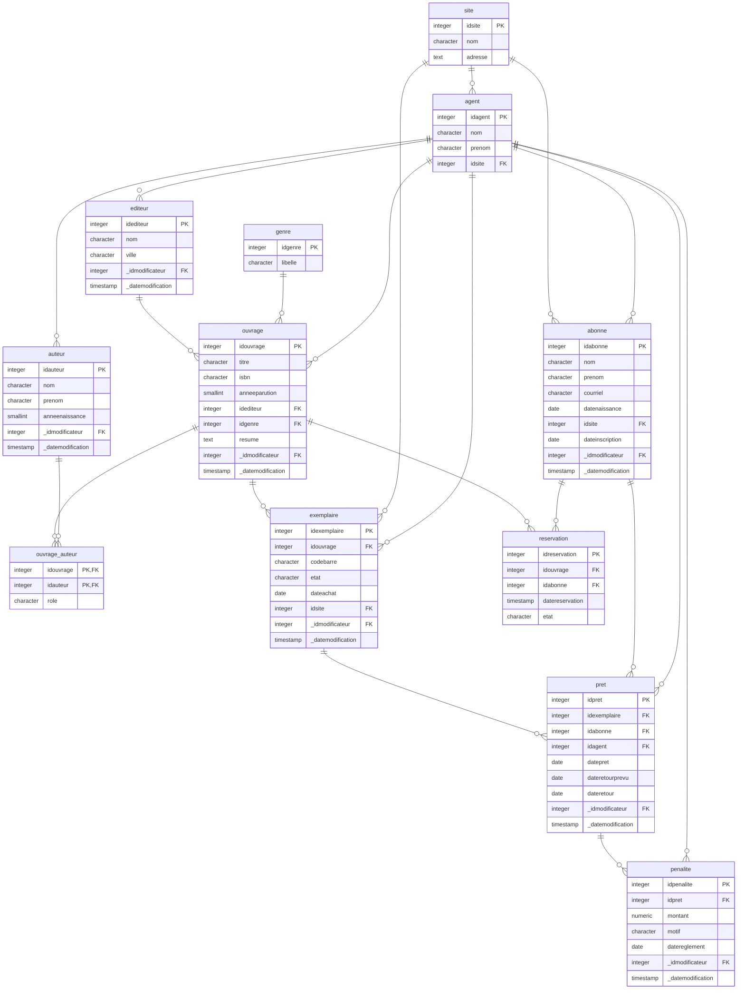
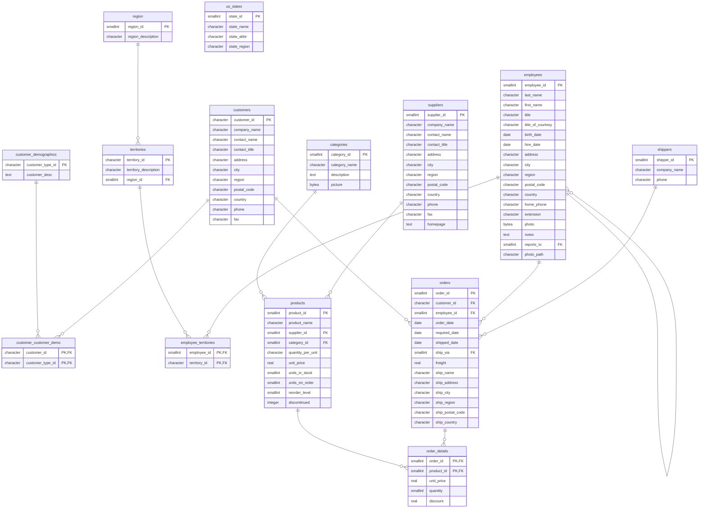
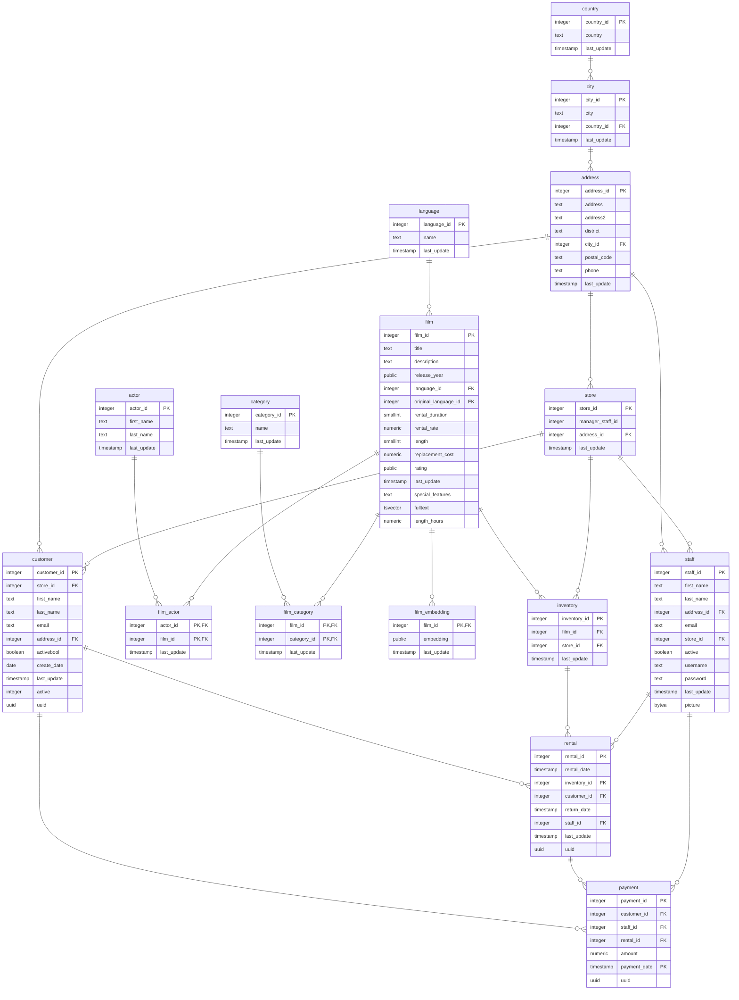

# Example diagrams (Mermaid)

The committed example models rendered as [Mermaid](https://mermaid.js.org/) `erDiagram` blocks —
GitHub and GitLab render them natively below. Generated with `mcdview.py <model> --to-mermaid`.

For the **interactive** explorer (isolate, zoom, search, drag), open the live demo:
<https://gheop.github.io/mcdview/>.

## Mediatheque



## Chinook


## Northwind



## Pagila




[Diagramme interactif](https://mcdview.dev/v/ukQeqaO_qUJIjpggQWrNgA)

```mermaid
erDiagram
    departement {
        serial iddepartement PK
        varchar codeinsee
        varchar libelle
        integer idregion
        timestamptz creenregistrement
        timestamptz majenregistrement
        uuid idmodificateur FK
        boolean actif
        integer ordre
    }
    pays {
        serial idpays PK
        varchar codeiso2
        varchar codeiso3
        varchar codeisonumerique
        varchar libelle
        timestamptz creenregistrement
        timestamptz majenregistrement
        uuid idmodificateur FK
        boolean actif
        integer ordre
    }
    ape {
        serial idape PK
        varchar code
        varchar libelle
        boolean actif
        integer ordre
        timestamptz creenregistrement
        timestamptz majenregistrement
        uuid idmodificateur FK
    }
    formejuridique {
        serial idformejuridique PK
        varchar code
        varchar libelle
        boolean actif
        integer ordre
        timestamptz creenregistrement
        timestamptz majenregistrement
        uuid idmodificateur FK
    }
    repetition {
        serial idrepetition PK
        varchar code
        varchar libelle
        timestamptz creenregistrement
        timestamptz majenregistrement
        uuid idmodificateur FK
        boolean actif
        integer ordre
    }
    sexe {
        serial idsexe PK
        varchar code
        varchar libelle
        varchar civilitecourte
        varchar civilite
        timestamptz creenregistrement
        timestamptz majenregistrement
        uuid idmodificateur FK
        boolean actif
        integer ordre
    }
    typevoie {
        serial idtypevoie PK
        varchar code
        varchar libelle
        timestamptz creenregistrement
        timestamptz majenregistrement
        uuid idmodificateur FK
        boolean actif
        integer ordre
    }
    nationalite {
        serial idnationalite PK
        varchar codeiso
        varchar libelle
        integer idpays FK
        varchar description
        timestamptz creenregistrement
        timestamptz majenregistrement
        uuid idmodificateur FK
        boolean actif
        integer ordre
    }
    commune {
        serial idcommune PK
        varchar codeinsee
        varchar libelle
        date fusion
        integer idcommunefusion FK
        integer iddepartement FK
        timestamptz creenregistrement
        timestamptz majenregistrement
        uuid idmodificateur FK
        integer ordre
    }
    adresse {
        uuid idadresse PK
        varchar ligne1
        varchar ligne2
        varchar numero
        integer idrepetition FK
        integer idtypevoie FK
        varchar voie
        varchar complement
        varchar distributionspeciale
        varchar codepostal
        integer idcommune FK
        varchar communeetrangere
        varchar cedex
        integer idpays FK
        varchar codereferentieltiers
        timestamptz creenregistrement
        timestamptz majenregistrement
        uuid idmodificateur FK
    }
    individu {
        uuid idindividu PK
        integer idsexe FK
        varchar nomnaissance
        varchar nomusage
        varchar prenom
        date naissance
        varchar communenaissance
        integer iddepartementnaissance FK
        integer idpaysnaissance FK
        boolean decede
        uuid idadressejuridique FK
        uuid idadressecorrespondance FK
        uuid idadressefacturation FK
        uuid idadresselivraison FK
        varchar codereferentieltiers
        timestamptz creenregistrement
        timestamptz majenregistrement
        uuid idmodificateur FK
    }
    individunationalite {
        uuid idindividunationalite PK
        uuid idindividu FK
        integer idnationalite FK
        timestamptz creenregistrement
        timestamptz majenregistrement
        uuid idmodificateur FK
    }
    individucourriel {
        uuid idindividucourriel PK
        uuid idindividu FK
        varchar courriel
        timestamptz creenregistrement
        timestamptz majenregistrement
        uuid idmodificateur FK
        boolean principal
    }
    individuprenomadditionnel {
        uuid idindividuprenomadditionnel PK
        uuid idindividu FK
        varchar prenom
        smallint ordre
        timestamptz creenregistrement
        timestamptz majenregistrement
        uuid idmodificateur FK
    }
    individutelephone {
        uuid idindividutelephone PK
        uuid idindividu FK
        varchar telephone
        boolean portable
        timestamptz creenregistrement
        timestamptz majenregistrement
        uuid idmodificateur FK
        boolean principal
    }
    entreprise {
        uuid identreprise PK
        varchar siren
        varchar numerodetenteur
        varchar numagrin
        varchar raisonsociale
        integer idformejuridique FK
        integer idape FK
        date creation
        date cessation
        boolean actif
        uuid idadressejuridique FK
        uuid idadressecorrespondance FK
        uuid idadressefacturation FK
        uuid idadresselivraison FK
        varchar codereferentieltiers
        timestamptz creenregistrement
        timestamptz majenregistrement
        uuid idmodificateur FK
    }
    entreprisecourriel {
        uuid identreprisecourriel PK
        uuid identreprise FK
        varchar courriel
        timestamptz creenregistrement
        timestamptz majenregistrement
        uuid idmodificateur FK
        boolean principal
    }
    entreprisesiteinternet {
        uuid identreprisesiteinternet PK
        uuid identreprise FK
        varchar siteinternet
        timestamptz creenregistrement
        timestamptz majenregistrement
        uuid idmodificateur FK
        boolean principal
    }
    entreprisetelephone {
        uuid identreprisetelephone PK
        uuid identreprise FK
        varchar telephone
        boolean portable
        timestamptz creenregistrement
        timestamptz majenregistrement
        uuid idmodificateur FK
        boolean principal
    }
    etablissement {
        uuid idetablissement PK
        uuid identreprise FK
        varchar siret
        varchar pacage
        varchar numagrit
        varchar raisonsociale
        integer idape FK
        date creation
        date cessation
        boolean actif
        uuid idadressejuridique FK
        uuid idadressecorrespondance FK
        uuid idadressefacturation FK
        uuid idadresselivraison FK
        varchar codereferentieltiers
        varchar lienmesparcelles
        timestamptz creenregistrement
        timestamptz majenregistrement
        uuid idmodificateur FK
    }
    etablissementcourriel {
        uuid idetablissementcourriel PK
        uuid idetablissement FK
        varchar courriel
        timestamptz creenregistrement
        timestamptz majenregistrement
        uuid idmodificateur FK
        boolean principal
    }
    etablissementsiteinternet {
        uuid idetablissementsiteinternet PK
        uuid idetablissement FK
        varchar siteinternet
        timestamptz creenregistrement
        timestamptz majenregistrement
        uuid idmodificateur FK
        boolean principal
    }
    etablissementtelephone {
        uuid idetablissementtelephone PK
        uuid idetablissement FK
        varchar telephone
        boolean portable
        timestamptz creenregistrement
        timestamptz majenregistrement
        uuid idmodificateur FK
        boolean principal
    }
    ougc {
        uuid idougc PK
        varchar libelle
        varchar courrielougc
        varchar telephoneougc
        timestamptz creenregistrement
        timestamptz majenregistrement
        uuid idmodificateur FK
    }
    utilisateur {
        uuid idutilisateur PK
        uuid idindividu FK
        varchar nomutilisateur
        varchar prenomutilisateur
        varchar identifiantcas
        timestamptz creenregistrement
        timestamptz majenregistrement
        uuid idmodificateur FK
    }
    droit {
        uuid iddroit PK
        varchar codeecran
        varchar libelle
        timestamptz creenregistrement
        timestamptz majenregistrement
        uuid idmodificateur FK
    }
    profilougc {
        uuid idutilisateur PK, FK
        uuid idougc PK, FK
        uuid idprofil PK, FK
        timestamptz creenregistrement
        timestamptz majenregistrement
        uuid idmodificateur FK
    }
    profil {
        uuid idprofil PK
        varchar libelle
        timestamptz creenregistrement
        timestamptz majenregistrement
        uuid idmodificateur FK
    }
    profildroit {
        uuid idprofildroit PK
        uuid iddroit FK
        uuid idprofil FK
        uuid idaccesapplication FK
        timestamptz creenregistrement
        timestamptz majenregistrement
        uuid idmodificateur FK
    }
    accesapplication {
        uuid idaccesapplication PK
        timestamptz creenregistrement
        timestamptz majenregistrement
        uuid idmodificateur FK
    }
    preleveur {
        uuid idpreleveur PK
        varchar numeroagence
        varchar numeropoliceeau
        varchar numerogestionnaire
        uuid idougc FK
        timestamptz creenregistrement
        timestamptz majenregistrement
        uuid idmodificateur FK
        uuid idindividu FK
        uuid idetablissement FK
        uuid idcontactpreleveur FK
    }
    exploitationpreleveur {
        uuid idexploitationpreleveur PK
        uuid idpreleveur FK
        uuid idetablissement FK
        real sauengage
        real saiengage
        date datedebut
        date datefin
        real surfaceirriguable
        timestamptz creenregistrement
        timestamptz majenregistrement
        uuid idmodificateur FK
        uuid idgestionnaireougc FK
        uuid idcampagne FK
    }
    parcelle {
        uuid idparcelle PK
        varchar numilot
        double surface
        timestamptz creenregistrement
        timestamptz majenregistrement
        uuid idmodificateur FK
        varchar nomparcelle
        varchar lieudit
        uuid idexploitationpreleveur FK
        uuid idcampagne FK
    }
    contactpreleveur {
        uuid idcontactpreleveur PK
        timestamptz creenregistrement
        timestamptz majenregistrement
        uuid idmodificateur FK
        uuid idindividu FK
        uuid idexploitationpreleveur FK
    }
    zonagegestion {
        serial idzonagegestion PK
        varchar libelle
        integer idparent FK
        timestamptz creenregistrement
        timestamptz majenregistrement
        uuid idmodificateur FK
        varchar code
        integer idtypezonagegestion FK
    }
    gestionnaireougc {
        uuid idgestionnaireougc PK
        timestamptz creenregistrement
        timestamptz majenregistrement
        uuid idmodificateur FK
        uuid idougc FK
        uuid idindividu FK
    }
    groupepoint {
        uuid idgroupepoint PK
        varchar nom
        timestamptz creenregistrement
        timestamptz majenregistrement
        uuid idmodificateur FK
        varchar numerogestionnaire
        varchar typesolmajoritaire
        integer volumehorsirrigation
    }
    preleveurgroupepoint {
        uuid idpreleveurgroupepoint PK
        timestamptz creenregistrement
        timestamptz majenregistrement
        uuid idmodificateur FK
        uuid idpreleveur FK
        uuid idgroupepoint FK
        uuid idcampagne FK
    }
    pointprelevement {
        uuid idpointprelevement PK
        point localisation
        date creation
        varchar sectioncadastrale
        varchar numerocadastral
        integer numeropoint
        varchar nompoint
        varchar lieudit
        varchar numeroagence
        varchar numeroadministration
        varchar numerogestionnaire
        varchar banquesoussol
        varchar typesol
        timestamptz creenregistrement
        timestamptz majenregistrement
        uuid idmodificateur FK
        boolean usagedomestique
        integer idnaturepompage FK
        integer idenergie FK
        uuid idretenue FK
        integer idcommune FK
        integer idzonagegestion FK
    }
    campagne {
        uuid idcampagne PK
        integer annee
        varchar libelle
        boolean campagnecourante
        timestamptz creenregistrement
        timestamptz majenregistrement
        uuid idmodificateur FK
    }
    periode {
        uuid idperiode PK
        varchar libelle
        date debutperiode
        date finperiode
        timestamptz creenregistrement
        timestamptz majenregistrement
        uuid idmodificateur FK
        uuid idcampagne FK
    }
    naturepompage {
        serial idnaturepompage PK
        varchar libelle
        timestamptz creenregistrement
        timestamptz majenregistrement
        uuid idmodificateur FK
        varchar code
        boolean actif
        integer ordre
    }
    energie {
        serial idenergie PK
        varchar libelle
        timestamptz creenregistrement
        timestamptz majenregistrement
        uuid idmodificateur FK
        varchar code
        boolean actif
        integer ordre
    }
    typezonagereglementaire {
        serial idtypezonagereglementaire PK
        varchar libelle
        timestamptz creenregistrement
        timestamptz majenregistrement
        uuid idmodificateur FK
        varchar code
        boolean actif
        integer ordre
    }
    zonagereglementairepointprelevement {
        uuid idzonagereglementairepointprelevement PK
        uuid idpointprelevement FK
        timestamptz creenregistrement
        timestamptz majenregistrement
        uuid idmodificateur FK
        integer idzonagereglementaire FK
    }
    retenue {
        uuid idretenue PK
        varchar nom
        timestamptz creenregistrement
        timestamptz majenregistrement
        uuid idmodificateur FK
    }
    canal {
        uuid idcanal PK
        varchar nom
        timestamptz creenregistrement
        timestamptz majenregistrement
        uuid idmodificateur FK
    }
    courseau {
        uuid idcourseau PK
        varchar nom
        timestamptz creenregistrement
        timestamptz majenregistrement
        uuid idmodificateur FK
    }
    nappe {
        uuid idnappe PK
        varchar nom
        timestamptz creenregistrement
        timestamptz majenregistrement
        uuid idmodificateur FK
    }
    source {
        uuid idsource PK
        varchar nom
        timestamptz creenregistrement
        timestamptz majenregistrement
        uuid idmodificateur FK
    }
    reseaudistribution {
        uuid idreseaudistribution PK
        varchar nom
        timestamptz creenregistrement
        timestamptz majenregistrement
        uuid idmodificateur FK
    }
    volumepreleve {
        uuid idvolumepreleve PK
        integer volumepreleve
        timestamptz creenregistrement
        timestamptz majenregistrement
        uuid idmodificateur FK
        uuid idperiode FK
        uuid idliengroupepoint FK
        uuid idcampagne FK
        date releve
        uuid idcompteur FK
    }
    compteur {
        uuid idcompteur PK
        real coeflecture
        date installation
        varchar nom
        varchar nomusuel
        varchar nomconstructeur
        varchar marque
        boolean informatif
        integer diametre
        varchar numeroAE
        integer indexinstallation
        integer indexhoraireinstallation
        date derniercontrole
        date derniereremiseenetat
        text commentaire
        uuid idcompteurremplacant FK
        date inactivation
        boolean inactif
        timestamptz creenregistrement
        timestamptz majenregistrement
        uuid idmodificateur FK
    }
    liengroupepoint {
        uuid idliengroupepoint PK
        integer tempprevision
        integer tempconsommation
        uuid idpointprelevement FK
        uuid idgroupepoint FK
        uuid idcampagne FK
        varchar nom
        timestamptz creenregistrement
        timestamptz majenregistrement
        uuid idmodificateur FK
    }
    liencompteurgroupepoint {
        uuid idliencompteurgroupepoint PK
        uuid idcompteur FK
        uuid idliengroupepoint FK
        uuid idcampagne FK
        integer coefconversion
        integer relevebrut
        boolean usagedebitdemande
        timestamptz creenregistrement
        timestamptz majenregistrement
        uuid idmodificateur FK
    }
    releveindex {
        uuid idreleveindex PK
        date releve
        integer index
        timestamptz creenregistrement
        timestamptz majenregistrement
        uuid idmodificateur FK
        uuid idcompteur FK
        uuid idcampagne FK
        uuid idperiode FK
    }
    responsablecompteur {
        uuid idresponsablecompteur PK
        timestamptz creenregistrement
        timestamptz majenregistrement
        uuid idmodificateur FK
        uuid idpreleveur FK
        uuid idcompteur FK
        uuid idcampagne FK
        uuid idindividu FK
    }
    demandeprelevement {
        uuid iddemandeprelevement PK
        integer debitdemande
        integer volumedemande
        integer surfaceirrigueetotale
        boolean valide
        uuid idcampagne FK
        uuid idperiode FK
        uuid idliencompteurgroupepoint FK
        uuid idpreleveurgroupepoint FK
        uuid idliengroupepoint FK
        date validation
        timestamptz creenregistrement
        timestamptz majenregistrement
        uuid idmodificateur FK
        uuid idtypagedemande FK
        uuid idtypeusagedemande FK
    }
    autorisation {
        uuid idautorisation PK
        integer volumereference
        uuid idperiode FK
        uuid idcampagne FK
        integer volumereparti
        integer volumeremplissageretenue
        integer debitautorise
        integer volumeautorise
        timestamptz creenregistrement
        timestamptz majenregistrement
        uuid idmodificateur FK
        uuid idpreleveurgroupepoint FK
    }
    lienzonagegestionougc {
        uuid idlienzonagegestionougc PK
        uuid idougc FK
        boolean hydrofonctionnel
        integer idparentzonagegestion FK
        uuid idcampagne FK
        integer idzonagegestion FK
        uuid idpointprelevement FK
        timestamptz creenregistrement
        timestamptz majenregistrement
        uuid idmodificateur FK
    }
    zonagereglementaire {
        serial idzonagereglementaire PK
        varchar libelle
        integer idtypezonage FK
        timestamptz creenregistrement
        timestamptz majenregistrement
        uuid idmodificateur FK
        varchar code
    }
    typezonagegestion {
        serial idtypezonagegestion PK
        varchar libelle
        timestamptz creenregistrement
        timestamptz majenregistrement
        uuid idmodificateur FK
        varchar code
        boolean actif
        integer ordre
    }
    lienzonagereglementaireougc {
        uuid idlienzonagereglementaireougc PK
        uuid idougc FK
        integer idzonage FK
        timestamptz creenregistrement
        timestamptz majenregistrement
        uuid idmodificateur FK
    }
    lienpointzonagemillesime {
        integer idzonagegestion PK, FK
        uuid idpointprelevement PK, FK
        uuid idcampagne PK, FK
        timestamptz creenregistrement
        timestamptz majenregistrement
        uuid idmodificateur FK
    }
    liengroupepointperiode {
        uuid idliengroupepointperiode PK
        integer volumemaximumspecifique
        timestamptz creenregistrement
        timestamptz majenregistrement
        uuid idmodificateur FK
        uuid idperiode FK
        uuid idliengroupepoint FK
    }
    detaildemandeculture {
        uuid iddetaildemandeculture PK
        real surfaceirriguee
        uuid iddemandeprelevement FK
        uuid idculture FK
        integer dosehectare
        integer nbtoureau
        integer volumetoureau
        timestamptz creenregistrement
        timestamptz majenregistrement
        uuid idmodificateur FK
    }
    culture {
        uuid idculture PK
        timestamptz creenregistrement
        timestamptz majenregistrement
        uuid idmodificateur FK
    }
    typeusagedemande {
        uuid idtypeusagedemande PK
        varchar libelle
        varchar code
        boolean actif
        integer ordre
        timestamptz creenregistrement
        timestamptz majenregistrement
        uuid idmodificateur FK
    }
    typagedemande {
        uuid idtypagedemande PK
        varchar libelle
        varchar code
        boolean actif
        integer ordre
        timestamptz creenregistrement
        timestamptz majenregistrement
        uuid idmodificateur FK
    }
    restriction {
        uuid idrestriction PK
        varchar libelle
        timestamptz creenregistrement
        timestamptz majenregistrement
        uuid idmodificateur FK
        uuid idcampagne FK
        uuid idougc FK
    }
    utilisateur ||--o{ profilougc : ""
    ougc ||--o{ profilougc : ""
    droit ||--o{ profildroit : ""
    profil ||--o{ profildroit : ""
    accesapplication ||--o{ profildroit : ""
    profil ||--o{ profilougc : ""
    preleveur ||--o{ exploitationpreleveur : ""
    etablissement ||--o{ exploitationpreleveur : ""
    exploitationpreleveur ||--o{ parcelle : ""
    individu ||--o{ contactpreleveur : ""
    exploitationpreleveur ||--o{ contactpreleveur : ""
    ougc ||--o{ preleveur : ""
    individu ||--o{ utilisateur : ""
    ougc ||--o{ gestionnaireougc : ""
    individu ||--o{ gestionnaireougc : ""
    gestionnaireougc ||--o{ exploitationpreleveur : ""
    preleveur ||--o{ preleveurgroupepoint : ""
    groupepoint ||--o{ preleveurgroupepoint : ""
    campagne ||--o{ periode : ""
    naturepompage ||--o{ pointprelevement : ""
    energie ||--o{ pointprelevement : ""
    pointprelevement ||--o{ zonagereglementairepointprelevement : ""
    commune ||--o{ pointprelevement : ""
    retenue ||--o{ pointprelevement : ""
    periode ||--o{ volumepreleve : ""
    pointprelevement ||--o{ liengroupepoint : ""
    groupepoint ||--o{ liengroupepoint : ""
    campagne ||--o{ liengroupepoint : ""
    campagne ||--o{ exploitationpreleveur : ""
    compteur ||--o{ liencompteurgroupepoint : ""
    liengroupepoint ||--o{ liencompteurgroupepoint : ""
    campagne ||--o{ liencompteurgroupepoint : ""
    campagne ||--o{ parcelle : ""
    compteur ||--o{ releveindex : ""
    campagne ||--o{ releveindex : ""
    periode ||--o{ releveindex : ""
    preleveur ||--o{ responsablecompteur : ""
    compteur ||--o{ responsablecompteur : ""
    campagne ||--o{ responsablecompteur : ""
    individu ||--o{ preleveur : ""
    individu ||--o{ responsablecompteur : ""
    campagne ||--o{ preleveurgroupepoint : ""
    liengroupepoint ||--o{ volumepreleve : ""
    periode ||--o{ autorisation : ""
    campagne ||--o{ autorisation : ""
    campagne ||--o{ demandeprelevement : ""
    periode ||--o{ demandeprelevement : ""
    liencompteurgroupepoint ||--o{ demandeprelevement : ""
    preleveurgroupepoint ||--o{ demandeprelevement : ""
    preleveurgroupepoint ||--o{ autorisation : ""
    campagne ||--o{ volumepreleve : ""
    etablissement ||--o{ preleveur : ""
    contactpreleveur ||--o{ preleveur : ""
    ougc ||--o{ lienzonagegestionougc : ""
    zonagegestion ||--o{ lienzonagegestionougc : ""
    typezonagegestion ||--o{ zonagegestion : ""
    zonagegestion ||--o{ pointprelevement : ""
    campagne ||--o{ lienzonagegestionougc : ""
    pointprelevement ||--o{ lienzonagegestionougc : ""
    zonagegestion ||--o{ lienpointzonagemillesime : ""
    pointprelevement ||--o{ lienpointzonagemillesime : ""
    campagne ||--o{ lienpointzonagemillesime : ""
    zonagereglementaire ||--o{ zonagereglementairepointprelevement : ""
    compteur ||--o{ volumepreleve : ""
    periode ||--o{ liengroupepointperiode : ""
    liengroupepoint ||--o{ liengroupepointperiode : ""
    liengroupepoint ||--o{ demandeprelevement : ""
    demandeprelevement ||--o{ detaildemandeculture : ""
    culture ||--o{ detaildemandeculture : ""
    typagedemande ||--o{ demandeprelevement : ""
    typeusagedemande ||--o{ demandeprelevement : ""
    campagne ||--o{ restriction : ""
    ougc ||--o{ restriction : ""
    utilisateur ||--o{ departement : ""
    utilisateur ||--o{ pays : ""
    utilisateur ||--o{ ape : ""
    utilisateur ||--o{ formejuridique : ""
    utilisateur ||--o{ repetition : ""
    utilisateur ||--o{ sexe : ""
    utilisateur ||--o{ typevoie : ""
    pays ||--o{ nationalite : ""
    utilisateur ||--o{ nationalite : ""
    commune ||--o{ commune : ""
    departement ||--o{ commune : ""
    utilisateur ||--o{ commune : ""
    commune ||--o{ adresse : ""
    pays ||--o{ adresse : ""
    typevoie ||--o{ adresse : ""
    repetition ||--o{ adresse : ""
    utilisateur ||--o{ adresse : ""
    sexe ||--o{ individu : ""
    departement ||--o{ individu : ""
    pays ||--o{ individu : ""
    adresse ||--o{ individu : ""
    utilisateur ||--o{ individu : ""
    individu ||--o{ individunationalite : ""
    nationalite ||--o{ individunationalite : ""
    utilisateur ||--o{ individunationalite : ""
    individu ||--o{ individucourriel : ""
    utilisateur ||--o{ individucourriel : ""
    individu ||--o{ individuprenomadditionnel : ""
    utilisateur ||--o{ individuprenomadditionnel : ""
    individu ||--o{ individutelephone : ""
    utilisateur ||--o{ individutelephone : ""
    ape ||--o{ entreprise : ""
    formejuridique ||--o{ entreprise : ""
    adresse ||--o{ entreprise : ""
    utilisateur ||--o{ entreprise : ""
    entreprise ||--o{ entreprisecourriel : ""
    utilisateur ||--o{ entreprisecourriel : ""
    entreprise ||--o{ entreprisesiteinternet : ""
    utilisateur ||--o{ entreprisesiteinternet : ""
    entreprise ||--o{ entreprisetelephone : ""
    utilisateur ||--o{ entreprisetelephone : ""
    entreprise ||--o{ etablissement : ""
    ape ||--o{ etablissement : ""
    adresse ||--o{ etablissement : ""
    utilisateur ||--o{ etablissement : ""
    etablissement ||--o{ etablissementcourriel : ""
    utilisateur ||--o{ etablissementcourriel : ""
    etablissement ||--o{ etablissementsiteinternet : ""
    utilisateur ||--o{ etablissementsiteinternet : ""
    etablissement ||--o{ etablissementtelephone : ""
    utilisateur ||--o{ etablissementtelephone : ""
    utilisateur ||--o{ ougc : ""
    utilisateur ||--o{ utilisateur : ""
    utilisateur ||--o{ droit : ""
    utilisateur ||--o{ profil : ""
    utilisateur ||--o{ profildroit : ""
    utilisateur ||--o{ accesapplication : ""
    utilisateur ||--o{ preleveur : ""
    utilisateur ||--o{ exploitationpreleveur : ""
    utilisateur ||--o{ parcelle : ""
    utilisateur ||--o{ contactpreleveur : ""
    zonagegestion ||--o{ zonagegestion : ""
    utilisateur ||--o{ zonagegestion : ""
    utilisateur ||--o{ gestionnaireougc : ""
    utilisateur ||--o{ groupepoint : ""
    utilisateur ||--o{ preleveurgroupepoint : ""
    utilisateur ||--o{ pointprelevement : ""
    utilisateur ||--o{ campagne : ""
    utilisateur ||--o{ periode : ""
    utilisateur ||--o{ naturepompage : ""
    utilisateur ||--o{ energie : ""
    utilisateur ||--o{ typezonagereglementaire : ""
    utilisateur ||--o{ zonagereglementairepointprelevement : ""
    utilisateur ||--o{ retenue : ""
    utilisateur ||--o{ canal : ""
    utilisateur ||--o{ courseau : ""
    utilisateur ||--o{ nappe : ""
    utilisateur ||--o{ source : ""
    utilisateur ||--o{ reseaudistribution : ""
    utilisateur ||--o{ volumepreleve : ""
    compteur ||--o{ compteur : ""
    utilisateur ||--o{ compteur : ""
    utilisateur ||--o{ liengroupepoint : ""
    utilisateur ||--o{ liencompteurgroupepoint : ""
    utilisateur ||--o{ releveindex : ""
    utilisateur ||--o{ responsablecompteur : ""
    utilisateur ||--o{ demandeprelevement : ""
    utilisateur ||--o{ autorisation : ""
    utilisateur ||--o{ lienzonagegestionougc : ""
    typezonagereglementaire ||--o{ zonagereglementaire : ""
    utilisateur ||--o{ zonagereglementaire : ""
    utilisateur ||--o{ typezonagegestion : ""
    ougc ||--o{ lienzonagereglementaireougc : ""
    zonagereglementaire ||--o{ lienzonagereglementaireougc : ""
    utilisateur ||--o{ lienzonagereglementaireougc : ""
    utilisateur ||--o{ lienpointzonagemillesime : ""
    utilisateur ||--o{ liengroupepointperiode : ""
    utilisateur ||--o{ detaildemandeculture : ""
    utilisateur ||--o{ culture : ""
    utilisateur ||--o{ typeusagedemande : ""
    utilisateur ||--o{ typagedemande : ""
    utilisateur ||--o{ restriction : ""
```
