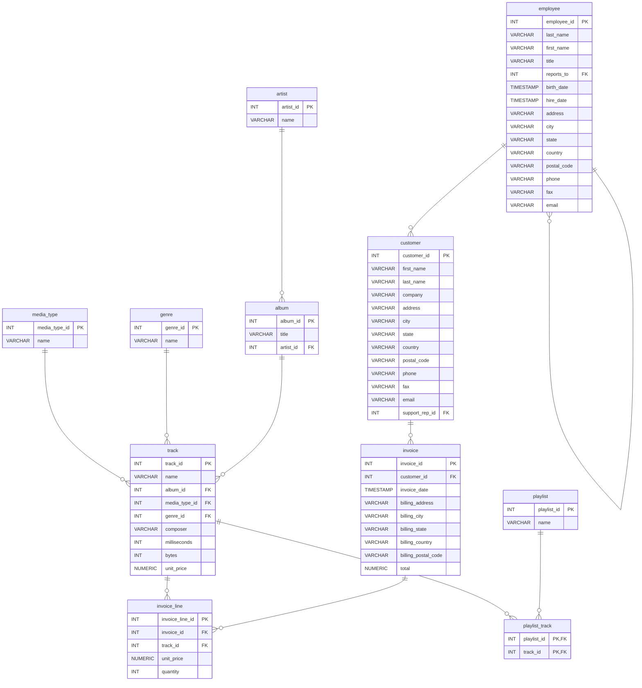
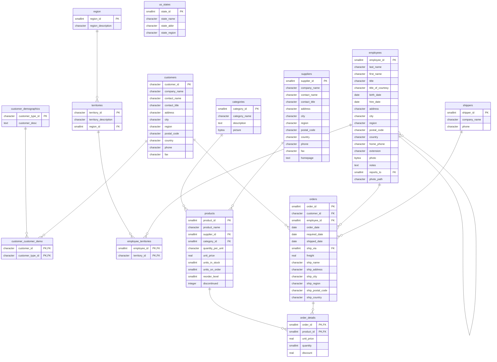
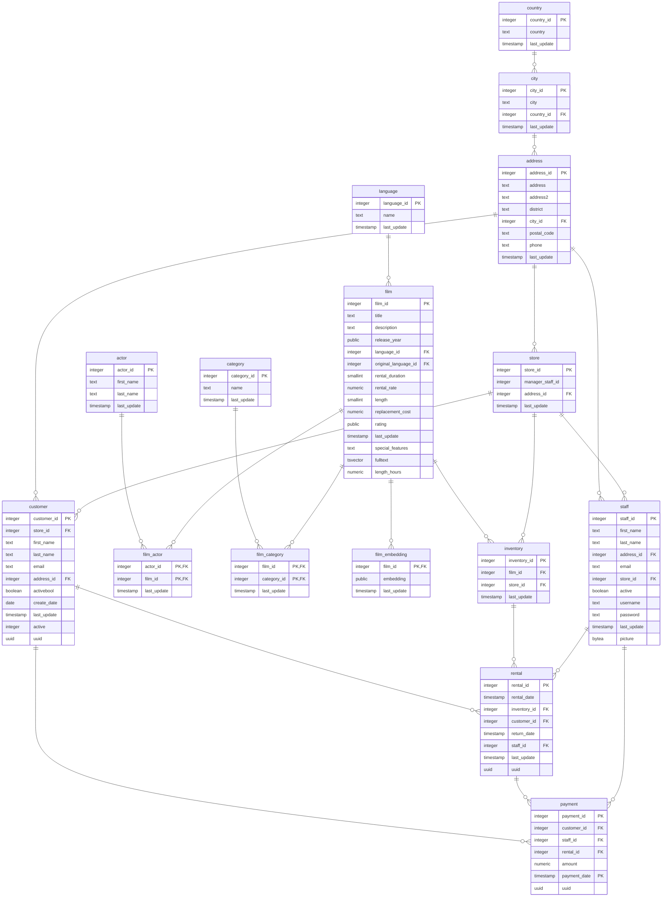

# Example diagrams (Mermaid)

These are the committed example models rendered as [Mermaid](https://mermaid.js.org/)
`erDiagram` blocks — GitHub and GitLab render them natively below, right in this
page. Generated from the SQL with `mcdview.py <model> --to-mermaid`.

This is the static view. For the **interactive** explorer (click a table to
isolate it, zoom, search, drag), open the live demo:
<https://gheop.github.io/mcdview/>.

## Mediatheque

## Chinook

## Northwind

## Pagila

